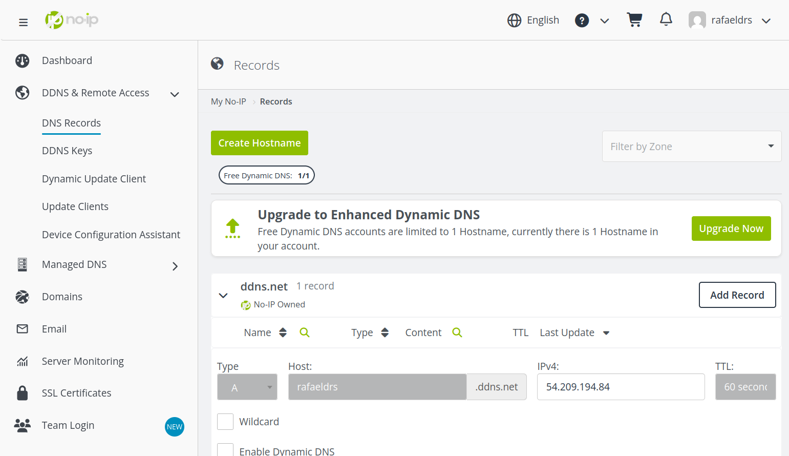

<!-- _class: title -->

# Configuración Nginx + HTTPS
## Ejemplo para rafaeldrs.ddns.net

---

# Índice

1. **Introducción**
2. **Instalación de Nginx**
3. **Obtención de Certificado SSL**
4. **Configuración de Nginx**
5. **Habilitación del Sitio**
6. **Configuración del Firewall**
7. **Renovación Automática**
8. **Verificación Final**
9. **Consideraciones Adicionales**

---

# Introducción

### ¿Qué vamos a configurar?

Vamos a configurar un servidor web **Nginx** para que responda a peticiones HTTPS del dominio **rafaeldrs.ddns.net**.

### ¿Por qué HTTPS?

- **Seguridad**: Encripta la comunicación entre cliente y servidor
- **Rendimiento**: HTTP/2 solo funciona con HTTPS
- **SEO**: Google prioriza sitios con HTTPS
- **Confianza**: El navegador muestra "Conexión segura"

---
# Introducción

### Componentes necesarios

- **Nginx**: Servidor web
- **Certbot**: Para obtener certificados SSL gratuitos
- **Let's Encrypt**: Autoridad certificadora


---

# Paso 0: Generación de un subdominio

### Registro
Para generar un subdominio lo primero que haremos será registrarnos en https://my.noip.com/

Una vez registrados, con la cuenta verificada y preparada, entramos en el apartado: 
- DDNS & Remote Access --> DNS Records

Desde esa sección añadimos un nuevo registro con el nombre de subdominio que queramos. El registro debe ser tipo A y que apunte a la IP pública de nuestra EC2 en AWS.

---
# Paso 0: Generación de un subdominio



---

# Paso 1: Instalación de Nginx

### ¿Qué es Nginx?

Nginx es un servidor web de alto rendimiento, ligero y eficiente que puede manejar miles de conexiones simultáneas.

### Comandos de instalación

```bash
# Ubuntu/Debian
sudo apt update
sudo apt install nginx
```

### Verificación

```bash
sudo systemctl status nginx
```

---

# Paso 2: Obtener Certificado SSL

### ¿Qué es Let's Encrypt?

Let's Encrypt es una **autoridad certificadora gratuita** que proporciona certificados SSL/TLS válidos reconocidos por todos los navegadores.

### Instalación de Certbot

```bash
sudo apt install certbot python3-certbot-nginx
```

### Obtención del certificado

```bash
sudo certbot --nginx -d rafaeldrs.ddns.net
```

---
# Paso 2: Obtener Certificado SSL

### ¿Qué hace este comando?

| Parte del comando | Función |
|-------------------|---------|
| `certbot` | Herramienta de Let's Encrypt |
| `--nginx` | Configura automáticamente Nginx |
| `-d rafaeldrs.ddns.net` | Especifica el dominio |

### Proceso interactivo

Certbot te pedirá:
1. Correo electrónico para notificaciones
2. Aceptar términos de servicio
3. Opcional: compartir correo con EFF

---
# Paso 2: Obtener Certificado SSL


### Ubicación de certificados

```
/etc/letsencrypt/live/rafaeldrs.ddns.net/
├── fullchain.pem    # Certificado + cadena
├── privkey.pem      # Clave privada
├── cert.pem         # Solo certificado
└── chain.pem        # Solo cadena
```

---

# Paso 3: Configuración de Nginx

### Estructura del archivo de configuración

```bash
sudo nano /etc/nginx/sites-available/rafaeldrs.ddns.net
```

Adapta el comando a tu dominio. **¡El siguiente archivo de configuración también lo tendrás que adaptar!**

Tienes que poner la parte del location que ya tienes, para que haga un proxy_pass de las peticiones a tu web (puerto 3000/4172/9000, etc...).

---
# Paso 3: Configuración de Nginx

```nginx
server {
    listen 80;
    server_name rafaeldrs.ddns.net;
    return 301 https://$server_name$request_uri;
}

server {
    listen 443 ssl http2;
    server_name rafaeldrs.ddns.net;

    ssl_certificate /etc/letsencrypt/live/rafaeldrs.ddns.net/fullchain.pem;
    ssl_certificate_key /etc/letsencrypt/live/rafaeldrs.ddns.net/privkey.pem;
    
    ssl_protocols TLSv1.2 TLSv1.3;
    ssl_ciphers HIGH:!aNULL:!MD5;
    ssl_prefer_server_ciphers on;

    root /var/www/rafaeldrs.ddns.net;
    index index.html index.htm;

    location / {
        try_files $uri $uri/ =404;
    }

    access_log /var/log/nginx/rafaeldrs.ddns.net-access.log;
    error_log /var/log/nginx/rafaeldrs.ddns.net-error.log;
}
```

---
# Explicación detallada - Bloque HTTP

### ¿Qué hace cada línea?

| Directiva | Significado |
|-----------|-------------|
| `server { }` | Define un bloque de servidor |
| `listen 80;` | Escucha en puerto 80 (HTTP) |
| `server_name rafaeldrs.ddns.net;` | Responde solo a este dominio |
| `return 301 https://...` | Redirección permanente a HTTPS |

---

# Explicación detallada - Bloque HTTP

### ¿Por qué redirigir HTTP → HTTPS?

- **301**: Redirección permanente (SEO-friendly)
- **$server_name**: Variable con el nombre del dominio
- **$request_uri**: Mantiene la URL original

**Ejemplo**: `http://rafaeldrs.ddns.net/about` → `https://rafaeldrs.ddns.net/about`

---
# Explicación detallada - Bloque HTTPS

```nginx
listen 443 ssl http2;
```

### Parámetros de escucha

| Parámetro | Descripción |
|-----------|-------------|
| `443` | Puerto estándar de HTTPS |
| `ssl` | Habilita SSL/TLS |
| `http2` | Protocolo HTTP/2 (más rápido) |

```nginx
ssl_certificate /etc/letsencrypt/live/rafaeldrs.ddns.net/fullchain.pem;
ssl_certificate_key /etc/letsencrypt/live/rafaeldrs.ddns.net/privkey.pem;
```

---
# Explicación detallada - Bloque HTTPS

### Certificados SSL

| Archivo | Contenido |
|---------|-----------|
| `fullchain.pem` | Certificado + cadena de confianza |
| `privkey.pem` | Clave privada (¡mantener secreta!) |

---

# Configuración de seguridad SSL

```nginx
ssl_protocols TLSv1.2 TLSv1.3;
ssl_ciphers HIGH:!aNULL:!MD5;
ssl_prefer_server_ciphers on;
```

---
# Configuración de seguridad SSL

### Protocolos SSL/TLS

| Protocolo | Estado | Notas |
|-----------|--------|-------|
| SSLv2 | Inseguro | Nunca usar |
| SSLv3 | Inseguro | Vulnerable |
| TLSv1.0 | Obsoleto | No recomendado |
| TLSv1.1 | Obsoleto | No recomendado |
| TLSv1.2 | Seguro | Compatible con todo |
| TLSv1.3 | Muy seguro | Más rápido, moderno |

---
# Configuración de seguridad SSL

### Cifrados (Ciphers)

- `HIGH`: Solo cifrados fuertes
- `!aNULL`: Excluye autenticación anónima
- `!MD5`: Excluye MD5 (inseguro)

---

# Configuración del sitio web
**Esta parte la tenéis que cambiar para adaptarlo a vuestro despliegue:**

```nginx
root /var/www/rafaeldrs.ddns.net;
index index.html index.htm;

location / {
    try_files $uri $uri/ =404;
}
```

---
# Configuración del sitio web

### Directivas explicadas

| Directiva | Función |
|-----------|---------|
| `root` | Directorio raíz del sitio |
| `index` | Archivos de inicio por defecto |
| `location /` | Maneja todas las URLs |
| `try_files` | Busca archivos en orden |


---
# Configuración del sitio web


### Flujo de `try_files`

```
Petición: /about
1. Busca /var/www/rafaeldrs.ddns.net/about (archivo)
2. Busca /var/www/rafaeldrs.ddns.net/about/ (directorio)
3. Si no existe → Error 404
```

---

# Logs y monitoreo

```nginx
access_log /var/log/nginx/rafaeldrs.ddns.net-access.log;
error_log /var/log/nginx/rafaeldrs.ddns.net-error.log;
```

### Tipos de logs

| Log | Contenido | Nivel por defecto |
|-----|-----------|-------------------|
| **access_log** | Todas las peticiones HTTP | info |
| **error_log** | Errores y advertencias | error |

### Formato del access_log

```
192.168.1.100 - - [05/Feb/2026:10:30:45 +0000] 
"GET /index.html HTTP/1.1" 200 1234 
"Mozilla/5.0" "https://google.com"
```

---

# Paso 4: Habilitar el sitio

### Habilitar configuración

```bash
sudo ln -s /etc/nginx/sites-available/rafaeldrs.ddns.net \
           /etc/nginx/sites-enabled/
```

### ¿Qué hace este enlace simbólico?

```
sites-available/  ← Almacena todas las configuraciones
sites-enabled/    ← Nginx solo lee de aquí
```
---
# Paso 4: Habilitar el sitio


### Verificar sintaxis

```bash
sudo nginx -t
```

**Salida esperada:**
```
nginx: the configuration file /etc/nginx/nginx.conf syntax is ok
nginx: configuration file /etc/nginx/nginx.conf test is successful
```

### Recargar Nginx

```bash
sudo systemctl reload nginx
```

---
# Paso 4: Habilitar el sitio

**¿Por qué `reload` y no `restart`?**
- `reload`: Sin tiempo de inactividad (zero downtime)
- `restart`: Detiene y reinicia (breve interrupción)

---

# Paso 5: Configuración del Security Group

### ¿Por qué necesitamos firewall?

El firewall controla qué puertos están accesibles desde Internet.

Debes verificar en AWS que el security group de la EC2 tenga los puertos adecuados abiertos.

---

# Paso 6: Renovación Automática

### ¿Por qué renovar?

Los certificados de Let's Encrypt **expiran a los 90 días**.

### Verificar renovación automática

```bash
sudo certbot renew --dry-run
```

### ¿Qué hace este comando?

- Simula el proceso de renovación
- Verifica que todo funcione correctamente
- **No** renueva realmente el certificado

---
# Paso 6: Renovación Automática

### Cron job para renovación

```bash
sudo crontab -e
```

Añadir esta línea:
```
0 3 * * * /usr/bin/certbot renew --quiet && systemctl reload nginx
```

---
# Paso 6: Renovación Automática

### Explicación del cron

| Campo | Valor | Significado |
|-------|-------|-------------|
| Minuto | `0` | Minuto 0 |
| Hora | `3` | 3 AM |
| Día mes | `*` | Todos los días |
| Mes | `*` | Todos los meses |
| Día semana | `*` | Todos los días |


**`&& systemctl reload nginx`**: Recarga Nginx solo si la renovación tiene éxito

---

# Paso 7: Verificación Final

### 1. Verificar estado de Nginx

```bash
sudo systemctl status nginx
```

**Busca:** `active (running)`

### 2. Verificar certificado SSL

```bash
openssl s_client -connect rafaeldrs.ddns.net:443 \
                 -servername rafaeldrs.ddns.net
```

### 3. Probar en navegador

Abrir: `https://rafaeldrs.ddns.net`

---
# Paso 7: Verificación Final

**Deberías ver:**
- Candado verde en la barra de direcciones
- "Conexión segura"
- Tu página web

### 4. Verificar con herramientas online

- [SSL Labs](https://www.ssllabs.com/ssltest/)
- [Why No Padlock](https://www.whynopadlock.com/)

---

# Consideraciones Adicionales

### 1. DNS (Sistema de Nombres de Dominio)

**Verificar que el dominio apunte correctamente:**

```bash
nslookup rafaeldrs.ddns.net
dig rafaeldrs.ddns.net
```

**Resultado esperado:**
```
rafaeldrs.ddns.net → [Tu IP pública]
```


---

# Troubleshooting

### Problema: "Failed to connect"

**Causas posibles:**
- Verifica el security group
- Port forwarding no configurado
- Nginx no está corriendo

**¿Has arrancado la web, ya sea con pm2 o con npm run start/dev...?**

---

# Troubleshooting II

### Problema: "Your connection is not private"

**Causas:**
- Certificado caducado
- Fecha/hora incorrecta en servidor
- Certificado para otro dominio

**Solución:**
```bash
sudo certbot renew
sudo systemctl reload nginx
```

---

# Resumen de Comandos

### Instalación
```bash
sudo apt update && sudo apt install nginx certbot python3-certbot-nginx
```

### Configuración
```bash
sudo nano /etc/nginx/sites-available/rafaeldrs.ddns.net
sudo ln -s /etc/nginx/sites-available/rafaeldrs.ddns.net /etc/nginx/sites-enabled/
sudo nginx -t && sudo systemctl reload nginx
```

### Certificado SSL
```bash
sudo certbot --nginx -d rafaeldrs.ddns.net
```


### Renovación
```bash
sudo certbot renew --dry-run
```

---

# Checklist Final

- [ ] Nginx instalado y funcionando
- [ ] Dominio rafaeldrs.ddns.net configurado en DNS
- [ ] Archivo de configuración creado en `/etc/nginx/sites-available/`
- [ ] Enlace simbólico creado en `/etc/nginx/sites-enabled/`
- [ ] Sintaxis de Nginx verificada (`nginx -t`)
- [ ] Certificado SSL obtenido con Certbot
- [ ] Firewall configurado (puertos 80 y 443)
- [ ] Sitio accesible en `https://rafaeldrs.ddns.net`
- [ ] Candado verde visible en navegador
- [ ] Cron job de renovación configurado

---

# Recursos Adicionales

### Documentación oficial

- [Nginx Documentation](https://nginx.org/en/docs/)
- [Let's Encrypt](https://letsencrypt.org/docs/)
- [Certbot](https://certbot.eff.org/docs/)

### Herramientas útiles

- **SSL Checker**: [SSL Labs](https://www.ssllabs.com/ssltest/)
- **DNS Checker**: [DNS Checker](https://dnschecker.org/)
- **HTTP/2 Test**: [HTTP/2 Test](https://http2.pro/)

---
# Recursos Adicionales

### Comandos útiles

```bash
# Ver logs en tiempo real
sudo tail -f /var/log/nginx/access.log

# Verificar puertos abiertos
sudo netstat -tlnp | grep nginx

# Test de velocidad
curl -o /dev/null -s -w 'Tiempo total: %{time_total}s\n' https://rafaeldrs.ddns.net
```